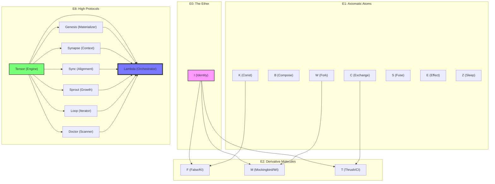

# Sigma Dependency Graph 🧬🕸️📊

This graph visualizes the **Crystal Lattice** architecture. It represents the "Pure Supply Chain" where every particle is either an independent Axiom or a strictly derived Molecule.

## Audit Result: ✅ PURE
- **No Spaghetti**: Connections are strictly vertical or between sibling layers.
- **No Circularity**: The graph is a directed acyclic lattice (DAL).
- **Axiomatic Root**: Everything traces back to `I` or the Fundamental Axioms.
